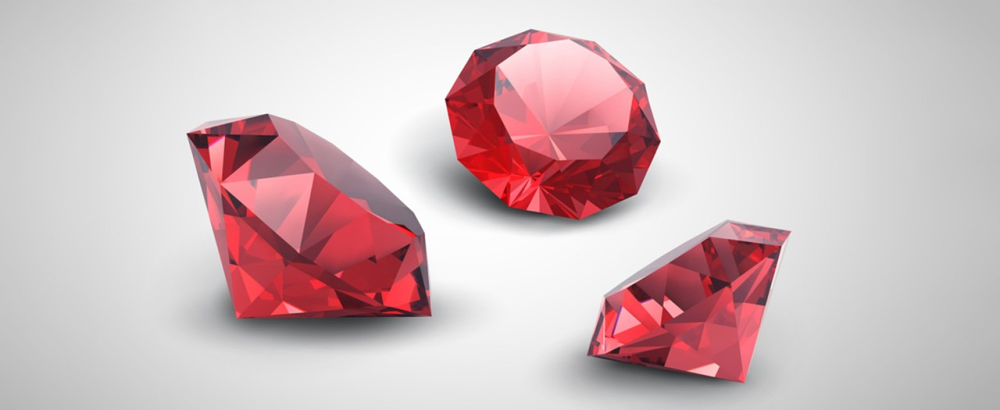

# Ruby Lab

# Homework

I'm not going to try and deny it: I'm a complete nerd. Anime. Magic: the Gathering. Brandon Sanderson. Dungeons and Dragons. I love it all. For the lab today, we are going to work on an interactive dice roller application.

If you were not able to attend the lab in person, check out the slide deck [here](#) for some of the basics of Ruby.

# Acknowledgements

I used the following resources while putting this project together:

- [Interactive CLI (Command Line Interface) applications with Ruby Gems](https://medium.com/@max.bautista97/interactive-cli-command-line-interface-applications-with-ruby-gems-f5c2f67c43e9)
